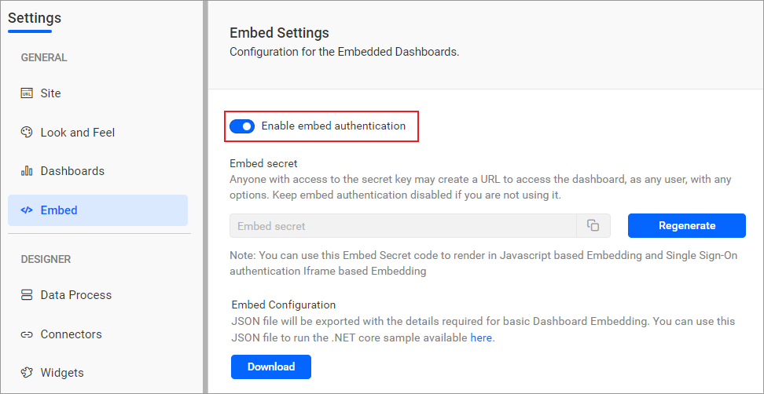

# Bold BI Embedded Sample in .NET WebForms

This project was created using ASP.NET WebForms 4.8. This application aims to demonstrate how to render the dashboard available on your Bold BI server.

## Dashboard view

## Requirements/Prerequisites

* [Visual Studio 2022](https://visualstudio.microsoft.com/downloads/)
* [.NET Framework 4.8](https://dotnet.microsoft.com/en-us/download/dotnet-framework)

### Supported browsers
  
* Google Chrome, Microsoft Edge, Mozilla Firefox.

## Configuration

* Please ensure you have enabled embed authentication on the `embed settings` page. If it is not currently enabled, please refer to the following image or detailed [instructions](https://help.boldbi.com/site-administration/embed-settings/#get-embed-secret-code?utm_source=github&utm_medium=backlinks) to enable it.

    

* To download the `embedConfig.json` file, please follow this [link](https://help.boldbi.com/site-administration/embed-settings/#get-embed-configuration-file?utm_source=github&utm_medium=backlinks) for reference. Additionally, you can refer to the following image for visual guidance.

     
     

* Copy the downloaded `embedConfig.json` file and paste it into the designated [location](https://github.com/boldbi/aspnet-web-forms-sample/tree/master/BoldBIEmbedSample) within the application. Please ensure you have placed it in the application, as shown in the following image.

    

## Developer IDE

* Visual Studio 2022(<https://visualstudio.microsoft.com/downloads/>)

### Run a Sample Using Visual Studio 2022

* Open the solution file `BoldBI.Embed.Sample.sln` in Visual studio.

* Run your `ASP.NET WebForms` sample in Visual Studio.

    

Please refer to the [help documentation](https://help.boldbi.com/embedding-options/embedding-sdk/samples/asp-net-web-forms/#how-to-run-the-sample?utm_source=github&utm_medium=backlinks) to know how to run the sample.

## Online Demos

Look at the Bold BI Embedding sample to live demo [here](https://samples.boldbi.com/embed?utm_source=github&utm_medium=backlinks).

## Documentation

A complete Bold BI Embedding documentation can be found on [Bold BI Embedding Help](https://help.boldbi.com/embedded-bi/javascript-based/?utm_source=github&utm_medium=backlinks).
